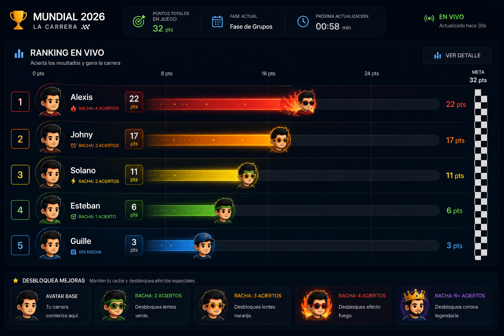

# Solution Architecture

## Contexto

Concurso interno de la empresa para predecir los 32 paises que avanzan de fase de grupos.
Tambien los finalistas y campeon del mundial.

## Asignacion de Puntos
- Por prediccion de Pais en fase de grupos 1 punto.
- Por finalista del Mundial 1 punto.
- Por Campeon del Mundial 1 punto.

## Requisitos funcionales

1. Registrar predicciones de usuarios sobre los 32 paises clasificados.
2. Actualizar puntajes durante los partidos cada 10 minutos, iniciando desde el minuto 10.
3. Obtener, almacenar y listar proximos partidos para soportar el recalculo continuo.
4. Mostrar un dashboard en vivo con formato de carrera de puntos.

## Requisitos del dashboard en vivo

- Vista tipo carrera: cada acierto suma puntos y el usuario con mayor puntaje avanza al frente.
- Avatares generados por la empresa y asignados de forma aleatoria a cada usuario.
- Cada usuario tiene un avatar que puede cambiar color o efecto cuando entra en racha.
- El usuario puede desbloquear mejoras visuales del avatar cuando mantiene racha.
- Definicion de racha: 2 o mas aciertos en el dia o en una ventana de tiempo definida.
- Opcion alternativa: cuando un usuario avanza puede desbloquear nuevos avatar que podra cambiar desde su perfil.

## Referencias visuales

## Registro de Usuarios

- Se debe importar una planilla de usuarios con email, generar el usuario y remitir un mail con el onboarding.
- El login sera por otp al mail.

## Stack tecnologico

- Frontend: Next.js
- Backend: Node.js + NestJS
- Base de datos: PostgreSQL

## Proceso de actualizacion (cron cada 10 minutos, durante un partido)

1. Consultar API-Football.
2. Actualizar resultados de partidos.
3. Recalcular puntajes de usuarios.
4. Emitir eventos por WebSocket.

## Flujo en frontend en tiempo real

1. Consumir eventos por Socket.IO.
2. Actualizar ranking en tiempo real.
3. Renderizar animacion tipo carrera.